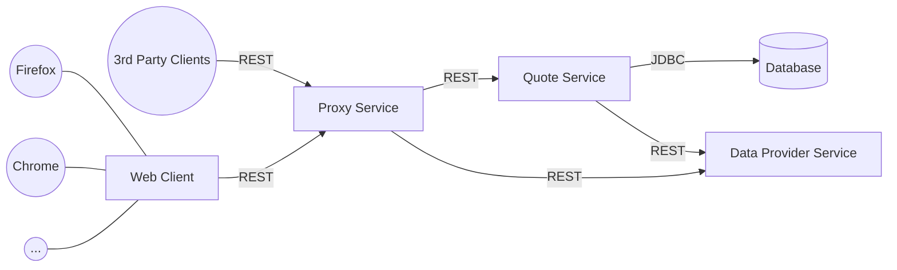

# Car Insurance Premium Calculator

A simple microservice application which provides car insurance premium calculation functionality via REST services.
Contains the following modules:
* **premium-quote**: A premium quote service which handles incoming premium quote requests and the business logic for the premium quote. Persists car premium quotes to a database via JDBC.
* **premium-data-provider**: Provides risk and regional data via separate REST endpoints.
* **premium-restproxy**: Provides access to functions for determining regional data and creating premium quotes for clients.
* **premium-webclient**: Simple web client created with Vaadin which uses the proxy service to provide car insurance premium quote functionality to end users via web.
* **premium-commons**: Contains commonly used code of other modules.
* **premium-restclients**: Provides rest clients for all endpoints to all services.
* **premium-test**: Contains CDC consumer tests for premium-restclients. Contains only test code.

## Service Overview


## System Requirements
* Java 17
* Docker (optional)

## QA
To ensure quality and functionality this project uses:
* Unit and integration tests with JUnit, Mockito and MockMvc for service methods and persistence layer
* CDC tests with spring-cloud-contract and MockMvc for all endpoints and clients to ensure each service and its client can communicate with each other. 

# Endpoints
The following endpoints exist:
* `/regions/v1` provided by premium-data-provider
* `/factors/v1` provided by premium-data-provider
* `/premiums/v1` provided by premium-quote
* `/api/v1` provided by premium-restproxy

Rest methods are documented in [apidoc.md](apidoc.md).

A separate API documentation for the proxy service exists in [apidoc-proxy.md](apidoc-proxy.md)


## Port usage
The services use the following ports per default but can be adjusted in the .env file for docker or via arguments:

|Service|Port|
|---|---|
|Data Provider Service|8083|
|Quote Service|8082|
|Proxy Service|8081|
|Web Client|8080|

## Persistence
The quote service persists incoming requests and its results to a database via JDBC, which allows to easily switch to different database systems, if necessary.

When Docker is used, a PostgreSQL database is employed — a reliable, high-performance solution that is easily deployable as a container. Otherwise, for ease of demonstration purpose, the quote service will use a local h2 database. 

Access to postgres database: `jdbc:postgresql://localhost:5432/quoteservice`

Access to h2 database (absolute path must be adjusted, the database is created in the working directory of premium-quote service): `jdbc:h2:file:C:\premium\premium-quote\database;AUTO_SERVER=TRUE;AUTO_RECONNECT=TRUE`

## Known Issues
* **premium-webclient**: Component style for vaadin-form-layout missing in production mode


## Setup
The commands are for PowerShell but are similar for other shells.
### 1. Clone repository
```powershell
git clone https://github.com/ArthurKwasny/premium.git
cd ./premium
```

### 2. Build project and start services

#### 2.1. With Docker (Compose)
Docker will create containers for all services and the webclient, as well as a postgres container with a dedicated volume `premium_postgres`.

The ports for the database, proxy service and web client are made accessible to the host machine through compose.yml configuration.
```powershell
# build project
.\mvnw.cmd clean install "-Pproduction,postgresql"
# profiles used:
# production for premium-webclient / Vaadin
# postgresql for premium-quote / PSQL JDBC driver

# build and start all containers with a postgres database
docker compose up
```
#### 2.2. Without Docker
Without docker a simple h2 database is used for demo purpose, which is located at premium/premium-quote/database.mv.db, if started as below.

Each command should be executed in its own window, starting from the project root folder:
```powershell
# build project
.\mvnw.cmd clean install "-Pproduction"
# profiles used:
# production for premium-webclient / Vaadin

# Data Provider Service
cd .\premium-data-provider
..\mvnw.cmd spring-boot:run "-Dspring-boot.run.arguments=`"--server.port=8083`""

# Quote Service
cd premium-quote
..\mvnw.cmd spring-boot:run "-Dspring-boot.run.arguments=`"--server.port=8082 --dataprovider.port=8083`""

# Proxy Service
cd premium-restproxy
..\mvnw.cmd spring-boot:run "-Dspring-boot.run.arguments=`"--server.port=8081 --quoteservice.port=8082 --dataprovider.port=8083`""

# Web Client
cd premium-webclient
..\mvnw.cmd spring-boot:run "-Pproduction" "-Dspring-boot.run.arguments=`"--server.port=8080 --proxyservice.port=8081`""
```


### 3. Access the web client
The frontend can be accessed via http://localhost:8080 if no other port was specified.
